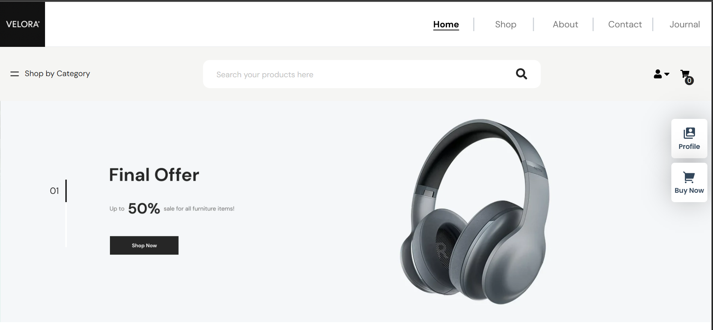
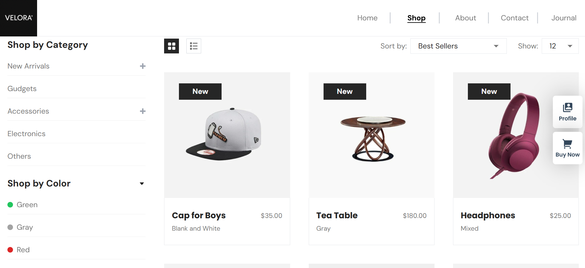
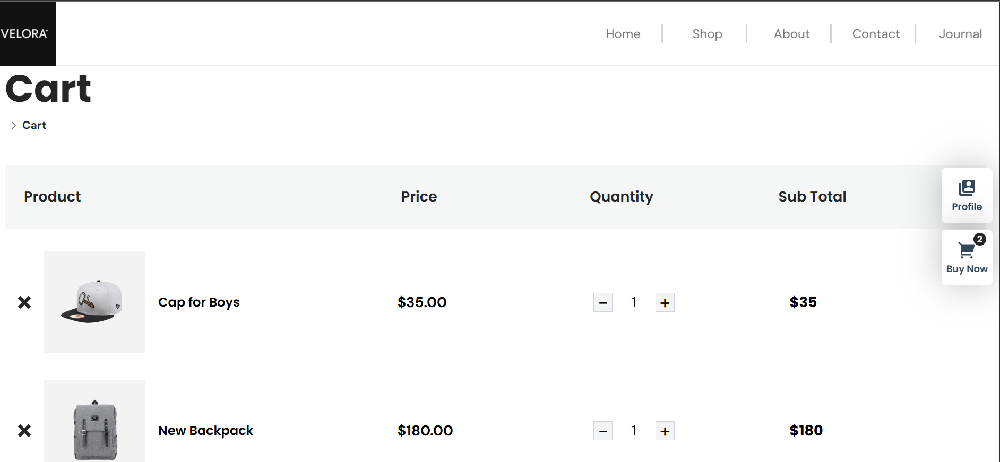

# ⚡ Velora — Modern eCommerce Web App 🛍️

**Velora** is a sleek, high-performance eCommerce platform built with **React.js**, **Tailwind CSS**, and **Redux Toolkit**. Designed with a website-first approach, Velora delivers a seamless shopping experience with intuitive navigation, clean UI, and robust state management.

---

## 🚀 Key Features

- 🧾 **Product Catalog** – Browse products with detailed pages and high-quality visuals  
- 🔍 **Smart Search & Filters** – Easily find products based on categories and keywords  
- 🛒 **Cart Management** – Add, remove, and update cart items with Redux Toolkit  
- 📱 **Responsive UI** – Fully optimized for all devices  
- ⚡ **High Performance** – Fast load times using optimized React components  
- 🎨 **Tailwind-Powered Design** – Modern, clean, and customizable styling  
- 🔄 **State Management** – Scalable and maintainable app state with Redux Toolkit

---

## 🛠️ Tech Stack

| Layer           | Technology            |
|----------------|------------------------|
| **Frontend**   | React.js               |
| **Styling**    | Tailwind CSS           |
| **State**      | Redux Toolkit          |
| **Routing**    | React Router DOM       |

---

## 📸 Preview

> 💡 *All screenshots are located in the `assets/images` folder.*

  
  


---

## 📦 Getting Started

To run this project locally:

```bash
# Clone the repository
git clone https://github.com/yourusername/velora.git

# Navigate to the project folder
cd velora

# Install dependencies
npm install

# Start the development server
npm start
```

Visit [http://localhost:3000](http://localhost:3000) in your browser to view the app.

---

## 🧪 Testing

To run unit or component tests:

```bash
npm test
```

---

## 📁 Project Structure

```
velora/
├── public/
├── src/
│   ├── assets/          # Images, icons, etc.
│   ├── components/      # Reusable UI components
│   ├── features/        # Redux slices and logic
│   ├── pages/           # Main application pages
│   ├── App.js
│   ├── index.js
│   └── store.js         # Redux store setup
└── tailwind.config.js
```

---

## 👨‍💻 Author

Made with ❤️ by [**Arunaabh Shriyam**](https://github.com/yourusername)

---

## 📃 License

This project is licensed under the [MIT License](LICENSE).
